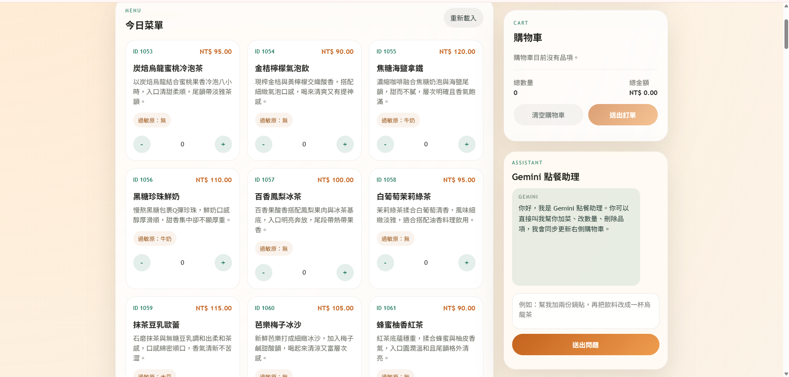
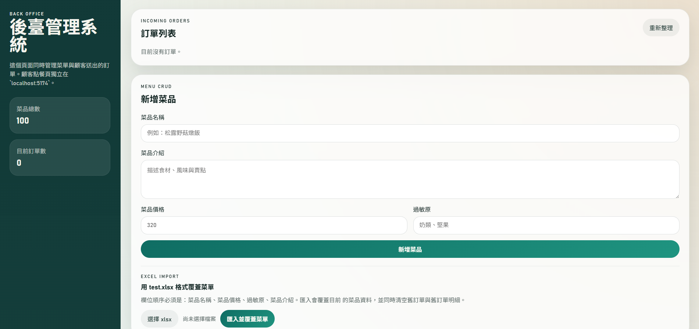

# 智慧點餐系統

本專案是一套本機 Docker 化的智慧點餐系統，包含顧客點餐網頁、後台管理網頁、Django API、MySQL 資料庫、phpMyAdmin 圖形化資料庫介面，以及 Gemini 點餐助理。

## 系統畫面

### 顧客端智慧點餐系統



### 後台管理系統



## 目前功能

- 顧客端與後台是兩個不同網頁。
- 顧客端可瀏覽菜單、加入購物車、調整數量、清空購物車、送出訂單。
- 顧客端右側常駐 Gemini 點餐助理，可協助推薦、查價格、查過敏原、加菜、改數量、刪除品項、清空購物車。
- 後台可對菜品做 CRUD：菜品 ID、菜品名稱、菜品介紹、菜品價格、過敏原。
- 後台可查看訂單列表，並刪除訂單。
- 後台可匯入 Excel `.xlsx` 覆蓋菜單。
- Excel 匯入菜單時會連同舊訂單一起清空，避免舊訂單指向不存在的菜品 ID。
- MySQL 可透過 phpMyAdmin 圖形介面查看。
- 專案預設可零設定啟動，不必先建立 `.env`。

## 技術組成

- `React`：顧客端與後台前端。
- `Vite`：React 開發伺服器。
- `Django`：後端 API。
- `PyMySQL`：Django 連接 MySQL。
- `openpyxl`：後台匯入 Excel `.xlsx`。
- `MySQL 8.4`：資料庫。
- `phpMyAdmin 5.2`：MySQL 圖形化管理介面。
- `Docker Compose`：一次啟動前端、後端、資料庫與 phpMyAdmin。
- `Gemini CLI`：顧客端點餐助理的 LLM 來源；不可用時會自動退回本地規則模式。

## 啟動網址

| 服務 | 用途 | 網址 |
| --- | --- | --- |
| 顧客端點餐系統 | 顧客點餐、購物車、Gemini 助理 | [http://localhost:5174](http://localhost:5174) |
| 後台管理系統 | 菜單 CRUD、Excel 匯入、訂單管理 | [http://localhost:5173](http://localhost:5173) |
| Django API | 後端 API | [http://localhost:8000](http://localhost:8000) |
| phpMyAdmin | MySQL 圖形化介面 | [http://localhost:8080](http://localhost:8080) |
| MySQL | 資料庫連線 | `localhost:3306` |

## 必要安裝

### 必裝：Docker Desktop

這個專案的主要執行方式是 Docker，因此本機只需要先安裝 Docker Desktop。

Windows 建議安裝：

- Docker Desktop for Windows
- WSL 2 backend，Docker Desktop 安裝流程通常會提示啟用

確認 Docker 可用：

```powershell
docker --version
docker compose version
```

### 建議安裝：Git

如果你要從 GitHub 拉下專案，建議安裝 Git。

確認 Git 可用：

```powershell
git --version
```

### 不需要另外安裝：Node.js、Python、MySQL、phpMyAdmin

如果你用 Docker 啟動，本機不需要另外安裝 Node.js、Python、MySQL 或 phpMyAdmin，原因如下：

- `admin-frontend` 與 `customer-frontend` 會在 Node 容器內執行 `npm install` 與 `npm run dev`。
- `backend` 會在 Python 容器內安裝 `backend/requirements.txt`。
- `db` 會自動使用 `mysql:8.4` Docker image。
- `phpmyadmin` 會自動使用 `phpmyadmin:5.2-apache` Docker image。
- `backend` image 內已安裝 Node，並在 build 時執行 `npm install -g @google/gemini-cli@latest`。

也就是說，正常使用本專案時，你不需要在 Windows 主機手動安裝前端或後端依賴。

## 零設定啟動

在專案根目錄執行：

```powershell
docker compose up --build -d
```

第一次啟動會需要下載 Docker images 並安裝容器內套件，時間會比較久。後續重建通常會快很多。

查看服務狀態：

```powershell
docker compose ps
```

關閉全部服務：

```powershell
docker compose down
```

完整重建並移除多餘舊容器：

```powershell
docker compose up --build -d --remove-orphans
```

只重建後端：

```powershell
docker compose up --build -d backend
```

只重建顧客端前端：

```powershell
docker compose up --build -d customer-frontend
```

只重建後台前端：

```powershell
docker compose up --build -d admin-frontend
```

查看後端 log：

```powershell
docker compose logs backend --tail 100
```

## `.env` 與 `.env.example`

本專案目前不需要 `.env` 也能啟動，因為 `docker-compose.yml` 已經內建本機開發用預設值。

`.env.example` 只用來提供可選覆寫設定：

```env
GEMINI_CLI_COMMAND=gemini
GEMINI_CLI_MODEL=gemini-2.5-flash
```

如果你要改 Gemini CLI 指令或模型，可以把 `.env.example` 複製成 `.env`：

```powershell
Copy-Item .env.example .env
```

一般情況不需要做這一步。

## Gemini CLI 安裝與登入

### 系統不登入 Gemini CLI 也能跑

Gemini 助理有兩層行為：

- Gemini CLI 可用且已登入：後端會優先呼叫 Gemini CLI。
- Gemini CLI 不可用或未登入：後端會退回本地規則模式，仍可處理常見加菜、改數量、刪除、清空與部分推薦。

因此本專案是零設定可跑，但如果你想讓助理使用真正的 Gemini CLI，就需要完成 Gemini CLI 登入。

### 本專案的 Gemini CLI 是怎麼安裝的

後端 Dockerfile 內已經包含：

```dockerfile
RUN npm install -g @google/gemini-cli@latest
```

所以只要你使用 Docker，就不需要在主機手動安裝 Gemini CLI 才能讓 container 找到 `gemini` 指令。

### 為什麼仍然需要登入

Gemini CLI 需要 Google 帳號驗證。官方 Gemini CLI 文件的標準安裝方式是：

```powershell
npm install -g @google/gemini-cli
gemini
```

第一次執行 `gemini` 時，依照官方文件，選擇 `Login with Google` 並完成瀏覽器登入。登入後 Gemini CLI 會在使用者目錄下建立設定與驗證資料。

本專案的 `docker-compose.yml` 會把 Windows 主機的 Gemini 設定資料夾掛進 backend container：

```yaml
volumes:
  - ${USERPROFILE}/.gemini:/root/.gemini
```

對 Windows 來說，主機端路徑是：

```text
%USERPROFILE%\.gemini
```

掛到 container 內後會變成：

```text
/root/.gemini
```

只要這個資料夾內有有效登入資料，backend container 裡的 Gemini CLI 就可以使用。

### 如果你要在 Windows 主機手動安裝 Gemini CLI

這不是零設定啟動的必要條件，只是為了產生 `%USERPROFILE%\.gemini` 登入資料。

1. 安裝 Node.js 20 或更新版本。
2. 確認 `node` 與 `npm` 可用：

```powershell
node --version
npm --version
```

3. 安裝 Gemini CLI：

```powershell
npm install -g @google/gemini-cli
```

4. 執行 Gemini CLI 並登入：

```powershell
gemini
```

5. 依照畫面提示選擇 Google 登入。
6. 登入後重新啟動後端：

```powershell
docker compose up --build -d backend
```

### Gemini CLI 相關來源

- Gemini CLI 官方文件：[Get Started with Gemini CLI](https://google-gemini.github.io/gemini-cli/docs/get-started/)
- npm 套件頁面：[@google/gemini-cli](https://www.npmjs.com/package/@google/gemini-cli)

## Gemini 助理的安全執行邏輯

本專案不是單純相信 Gemini 的文字回覆，而是做了「後端強制綁定」：

- Gemini 只負責理解語意並產生候選 `actions`。
- 後端會驗證 `actions` 是否能真的操作目前菜單與購物車。
- 如果 Gemini 回覆「已加入」、「已更新」、「已清空」但沒有對應 `actions`，後端會攔截。
- 後端能用本地規則補出 `actions` 時會自動補上。
- 如果後端補不出來，會改回「我還沒有更新購物車」類型的澄清訊息，避免前端顯示假的成功訊息。

支援的 `actions`：

```json
[
  {
    "type": "set_quantity",
    "menu_item_id": 1,
    "quantity": 2
  },
  {
    "type": "remove_item",
    "menu_item_id": 1
  },
  {
    "type": "clear_cart"
  }
]
```

## 顧客端使用流程

1. 開啟 [http://localhost:5174](http://localhost:5174)。
2. 從菜單選擇品項。
3. 用 `+` / `-` 調整數量。
4. 或使用右側 Gemini 點餐助理，例如：
   - `幫我加兩份蔥香牛肉捲餅`
   - `來杯冰的`
   - `烏龍`
   - `兩份`
   - `清空`
   - `推薦一個飯類`
   - `蜜桃冷泡茶多少錢`
5. 確認購物車內容與總價。
6. 可按 `清空購物車` 或 `送出訂單`。

注意：Gemini 助理不能直接送出訂單。送單必須由使用者按頁面上的 `送出訂單` 按鈕。

## 後台使用流程

1. 開啟 [http://localhost:5173](http://localhost:5173)。
2. 在菜單管理區新增、修改、刪除菜品。
3. 在訂單列表查看顧客送出的訂單。
4. 可刪除訂單。
5. 需要大量更新菜單時，可使用 Excel 匯入。

## Excel 匯入規則

後台可上傳 `.xlsx` 檔案，欄位需符合以下格式：

```text
菜品名稱 | 菜品價格 | 過敏原 | 菜品介紹
```

匯入時系統會：

- 清空 `menu_orderitem`
- 清空 `menu_order`
- 清空 `menu_menuitem`
- 重新建立整份菜單

重要影響：

- 匯入格式本身不包含 `菜品 ID`。
- `菜品 ID` 由資料庫自動產生。
- 每次匯入後，新的菜單 ID 可能和上一版不同。
- 因為菜單 ID 會重建，所以舊訂單會一併清空，避免訂單指向不存在的菜品。

## 菜單與聊天同步機制

為避免後台匯入新菜單後，顧客端仍保留舊菜單 ID，前端有同步保護：

- 每 5 秒檢查一次菜單是否更新。
- 送出聊天前會先同步一次菜單。
- 如果助理回傳的 `menu_item_id` 不在前台目前菜單中，前台會重新抓菜單再套用。
- 當前台偵測到菜單已變更時，會清空購物車並重置助理對話。

## API 一覽

### 菜單 API

```text
GET    /api/menu-items/
POST   /api/menu-items/
POST   /api/menu-items/import-xlsx/
GET    /api/menu-items/<id>/
PUT    /api/menu-items/<id>/
DELETE /api/menu-items/<id>/
```

新增或修改菜單範例：

```json
{
  "name": "蒜香牛排奶油炒飯",
  "description": "奶油香氣包覆粒粒分明白飯，搭配牛排與蒜香拌炒。",
  "price": "220.00",
  "allergens": "奶類"
}
```

### 訂單 API

```text
GET    /api/orders/
POST   /api/orders/
GET    /api/orders/<id>/
DELETE /api/orders/<id>/
```

建立訂單範例：

```json
{
  "items": [
    {
      "menu_item_id": 1,
      "quantity": 2
    },
    {
      "menu_item_id": 3,
      "quantity": 1
    }
  ]
}
```

### 聊天 API

```text
POST /api/chat/
```

請求範例：

```json
{
  "messages": [
    {
      "role": "user",
      "content": "幫我加兩份蔥香牛肉捲餅"
    }
  ],
  "cart": [
    {
      "menu_item_id": 1,
      "quantity": 1
    }
  ]
}
```

回應範例：

```json
{
  "reply": "已將蔥香牛肉捲餅更新為 2 份。",
  "actions": [
    {
      "type": "set_quantity",
      "menu_item_id": 1,
      "quantity": 2
    }
  ],
  "model": "gemini-2.5-flash"
}
```

說明：

- `menu_item_id` 會依照目前資料庫菜單而定。
- 如果菜單重新匯入，ID 可能改變。
- 前端購物車只根據 `actions` 更新，不根據自然語言文字更新。

## MySQL 連線資訊

| 欄位 | 值 |
| --- | --- |
| Host | `localhost` |
| Port | `3306` |
| Database | `smart_ordering` |
| User | `smart_user` |
| Password | `smart_pass` |
| Root Password | `root_pass` |

phpMyAdmin 網址：

- [http://localhost:8080](http://localhost:8080)

主要資料表：

- `menu_menuitem`
- `menu_order`
- `menu_orderitem`

SQL CRUD 範例：

- [docs/mysql-crud-examples.sql](./docs/mysql-crud-examples.sql)

## 專案目錄

```text
.
├─ admin-frontend
├─ customer-frontend
├─ backend
├─ docs
├─ scripts
├─ docker-compose.yml
├─ .env.example
├─ order_system.png
├─ order_system_backstage.png
└─ README.md
```

## 常見問題

### 拉下 repo 後沒有 `.env` 可以跑嗎

可以。`.env` 沒有被提交到 GitHub，但 `docker-compose.yml` 已經有預設值。

### Gemini CLI 沒登入可以跑嗎

可以。系統會退回本地規則模式，只是自然語言理解能力會比 Gemini CLI 模式簡單。

### Gemini 回覆了但購物車沒更新怎麼辦

目前後端已做 action 綁定保護。購物車只會根據 `actions` 更新，如果模型文字宣稱更新但沒有 actions，後端會攔截，避免前端顯示假的成功。

如果仍遇到異常，建議：

- 重新整理顧客端頁面。
- 確認後台是否剛匯入菜單。
- 查看後端 log：

```powershell
docker compose logs backend --tail 100
```

### 為什麼 Excel 匯入後舊訂單會消失

這是目前設計規格。Excel 匯入會重建菜單 ID，如果保留舊訂單，舊訂單可能會指向不存在的菜品。

### 如何查看資料庫

開啟：

- [http://localhost:8080](http://localhost:8080)

或用 MySQL Client 連線：

```text
localhost:3306
```

## 備註

- backend 啟動時會先等待 MySQL 可連線，再自動執行 migration。
- 顧客端與後台是兩個獨立 React 網頁。
- 這是本機開發與展示版本，不是正式 production 部署配置。
- `docker-compose.yml` 目前主要以 Windows 開發環境為目標，因為 Gemini CLI 掛載路徑使用 `${USERPROFILE}/.gemini`。
